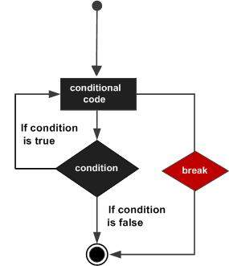

# C++ Loop Types

There may be a situation, when you need to execute a block of code several number of times. In general, statements are executed sequentially: The first statement in a function is executed first, followed by the second, and so on.

Programming languages provide various control structures that allow for more complicated execution paths.

A loop statement allows us to execute a statement or group of statements multiple times and following is the general from of a loop statement in most of the programming languages:


## Cycle type

C++ programming language provides the following type of loops to handle looping requirements.

| Cycle Type | Description |
| ---- | ---- |
| [while loop](http://www.runoob.com/cplusplus/cpp-while-loop.html) | Repeats a statement or group of statements while a given condition is true. It tests the condition before executing the loop body. |
| [for loop](http://www.runoob.com/cplusplus/cpp-for-loop.html) | Execute a sequence of statements multiple times and abbreviates the code that manages the loop variable. |
| [do...while loop](http://www.runoob.com/cplusplus/cpp-do-while-loop.html) | Like a ‘while’ statement, except that it tests the condition at the end of the loop body. |
| [nested loops](http://www.runoob.com/cplusplus/cpp-nested-loops.html) | You can use one or more loop inside any another ‘while’, ‘for’ or ‘do..while’ loop. |

### C++ while loop

A while loop statement repeatedly executes a target statement as long as a given condition is true.

The syntax of a while loop in C++ is: 

```C++
while(condition) {
   statement(s);
}
```

Here, statement(s) may be a single statement or a block of statements. The condition may be any expression, and true is any non-zero value. The loop iterates while the condition is true.

When the condition becomes false, program control passes to the line immediately following the loop.


Here, key point of the while loop is that the loop might not ever run. When the condition is tested and the result is false, the loop body will be skipped and the first statement after the while loop will be executed.

**Example**

```C++
#include <iostream>
 
int main () {
   // Local variable declaration:
   int a = 10;

   // while loop execution
   while( a < 20 ) {
      std::cout << "value of a: " << a << std::endl;
      a++;
   }
 
   return 0;
}
```

When the above code is compiled and executed, it produces the following result: 

```C++
value of a: 10
value of a: 11
value of a: 12
value of a: 13
value of a: 14
value of a: 15
value of a: 16
value of a: 17
value of a: 18
value of a: 19
```

### C++ for loop

A for loop is a repetition control structure that allows you to efficiently write a loop that needs to execute a specific number of times.

The syntax of a for loop in C++ is: 

```C++
for ( init; condition; increment ) {
   statement(s);
}
```


**Example**

```C++
#include <iostream>
 
int main () {
   // for loop execution
   for( int a = 10; a < 20; a = a + 1 ) {
      std::cout << "value of a: " << a << std::endl;
   }
 
   return 0;
}
```

When the above code is compiled and executed, it produces the following result:

```C++
value of a: 10
value of a: 11
value of a: 12
value of a: 13
value of a: 14
value of a: 15
value of a: 16
value of a: 17
value of a: 18
value of a: 19
```

### C++ do...while loop

Unlike **for** and **while** loops, which test the loop condition at the top of the loop, the do...while loop checks its condition at the bottom of the loop.

A **do...while** loop is similar to a while loop, except that a do...while loop is guaranteed to execute at least one time.

The syntax of a do...while loop in C++ is:

```C++
do {
   statement(s);
} 
while( condition );
```


**Example**

```C++
#include <iostream>
 
int main () {
   // Local variable declaration:
   int a = 10;

   // do loop execution
   do {
      std::cout << "value of a: " << a << std::endl;
      a = a + 1;
   } while( a < 20 );
 
   return 0;
}
```

When the above code is compiled and executed, it produces the following result:

```C++
value of a: 10
value of a: 11
value of a: 12
value of a: 13
value of a: 14
value of a: 15
value of a: 16
value of a: 17
value of a: 18
value of a: 19
```

### C++ nested loops

A loop can be nested inside of another loop. C++ allows at least 256 levels of nesting.

The syntax for a **nested for loop** statement in C++ is as follows:

```C++
for ( init; condition; increment ) {
   for ( init; condition; increment ) {
      statement(s);
   }
   statement(s); // you can put more statements.
}
```

The syntax for a **nested while loop** statement in C++ is as follows:

```C++
while(condition) {
   while(condition) {
      statement(s);
   }
   statement(s); // you can put more statements.
}
```

The syntax for a **nested do...while** loop statement in C++ is as follows:

```C++
do {
   statement(s); // you can put more statements.
   do {
      statement(s);
   } while( condition );

} while( condition );
```

**Example**

```C++
#include <iostream>
 
int main () {
   int i, j;
   
   for(i = 2; i<100; i++) {
      for(j = 2; j <= (i/j); j++)
         if(!(i%j)) break; // if factor found, not prime
         if(j > (i/j)) std::cout << i << " is prime\n";
   }
   
   return 0;
}
```

This would produce the following result:

```C++
2 is prime
3 is prime
5 is prime
7 is prime
11 is prime
13 is prime
17 is prime
19 is prime
23 is prime
29 is prime
31 is prime
37 is prime
41 is prime
43 is prime
47 is prime
53 is prime
59 is prime
61 is prime
67 is prime
71 is prime
73 is prime
79 is prime
83 is prime
89 is prime
97 is prime
```

## Loop control statement

Loop control statements change execution from its normal sequence. When execution leaves a scope, all automatic objects that were created in that scope are destroyed.

C++ supports the following control statements.

| Control statement | Description |
| ---- | ---- |
| [break Statement](http://www.runoob.com/cplusplus/cpp-break-statement.html) | Terminates the **loop** or **switch** statement and transfers execution to the statement immediately following the loop or switch.着 loop 或 switch 的下一条语句。 |
| [continue Statement](http://www.runoob.com/cplusplus/cpp-continue-statement.html) | Causes the loop to skip the remainder of its body and immediately retest its condition prior to reiterating. |
| [goto Statement](http://www.runoob.com/cplusplus/cpp-goto-statement.html) | Transfers control to the labeled statement. Though it is not advised to use goto statement in your program. |

### C++ break statement

The break statement has the following two usages in C++:

- When the break statement is encountered inside a loop, the loop is immediately terminated and program control resumes at the next statement following the loop.

- It can be used to terminate a case in the switch statement (covered in the next chapter).

If you are using nested loops (i.e., one loop inside another loop), the break statement will stop the execution of the innermost loop and start executing the next line of code after the block.

The syntax of a break statement in C++ is:

```C++
break;
```



**Example**

```C++
#include <iostream>
 
int main () {
   // Local variable declaration:
   int a = 10;

   // do loop execution
   do {
      std::cout << "value of a: " << a << std::endl;
      a = a + 1;
      if( a > 15) {
         // terminate the loop
         break;
      }
   } while( a < 20 );
 
   return 0;
}
```

When the above code is compiled and executed, it produces the following result:

```C++
value of a: 10
value of a: 11
value of a: 12
value of a: 13
value of a: 14
value of a: 15
```

### C++ continue statement

The **continue** statement works somewhat like the break statement. Instead of forcing termination, however, continue forces the next iteration of the loop to take place, skipping any code in between.

For the **for** loop, continue causes the conditional test and increment portions of the loop to execute. For the **while** and **do...while** loops, program control passes to the conditional tests.

The syntax of a continue statement in C++ is:

```C++
continue;
```


**Example**

```C++
Live Demo
#include <iostream>
 
int main () {
   // Local variable declaration:
   int a = 10;

   // do loop execution
   do {
      if( a == 15) {
         // skip the iteration.
         a = a + 1;
         continue;
      }
      std::cout << "value of a: " << a << std::endl;
      a = a + 1;
   } 
   while( a < 20 );
 
   return 0;
}
```

When the above code is compiled and executed, it produces the following result:

```C++
value of a: 10
value of a: 11
value of a: 12
value of a: 13
value of a: 14
value of a: 16
value of a: 17
value of a: 18
value of a: 19
```

## Infinite loop

A loop becomes infinite loop if a condition never becomes false. The **for** loop is traditionally used for this purpose. Since none of the three expressions that form the ‘for’ loop are required, you can make an endless loop by leaving the conditional expression empty.

```C++
#include <iostream>
 
int main ()
{

   for( ; ; )
   {
      printf("This loop will run forever.\n");
   }

   return 0;
}
```

When the conditional expression is absent, it is assumed to be true. You may have an initialization and increment expression, but C++ programmers more commonly use the ‘for (;;)’ construct to signify an infinite loop.

**NOTE** − You can terminate an infinite loop by pressing Ctrl + C keys.

# Practices & Exercises

## Practices

1. Display Multiplication table up to 10

```C++
Enter an integer: 5
5 * 1 = 5
5 * 2 = 10
5 * 3 = 15
5 * 4 = 20
5 * 5 = 25
5 * 6 = 30
5 * 7 = 35
5 * 8 = 40
5 * 9 = 45
5 * 10 = 50
```

2. Display multiplication table up to a given range:

```C++
Enter an integer: 8
Enter range: 12
8 * 1 = 8
8 * 2 = 16
8 * 3 = 24
8 * 4 = 32
8 * 5 = 40
8 * 6 = 48
8 * 7 = 56
8 * 8 = 64
8 * 9 = 72
8 * 10 = 80
8 * 11 = 88
8 * 12 = 96
```

## Exercises

1. Write a program for Bulls and Cows (猜數字/終極密碼). The program first generates a random integer as the secret number s. For simplicity, assume that 1 <= s <= 100. Also, x denotes the input from the player. Then the program takes x and reports a updated range repeatedly until x == s. Note that the range should shrink monotonically because the player is limited to answer an integer between the range. If the range is one integer left, then the player loses the game.
