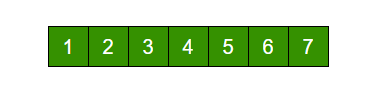

# C++ Arrays

C++ provides a data structure, the array, which stores a fixed-size sequential collection of elements of the same type. An array is used to store a collection of data, but it is often more useful to think of an array as a collection of variables of the same type.

Instead of declaring individual variables, such as number0, number1, ..., and number99, you declare one array variable such as numbers and use numbers[0], numbers[1], and ..., numbers[99] to represent individual variables. A specific element in an array is accessed by an index.

All arrays consist of contiguous memory locations. The lowest address corresponds to the first element and the highest address to the last element.

## Declaring Arrays

To declare an array in C++, the programmer specifies the type of the elements and the number of elements required by an array as follows：

```C++
type arrayName [ arraySize ];
```

This is called a single-dimension array. The arraySize must be an integer constant greater than zero and type can be any valid C++ data type. For example, to declare a 10-element array called balance of type double, use this statement ：

```C++
double balance[10];
```

## Initializing Arrays

You can initialize C++ array elements either one by one or using a single statement as follows：

```C++
double balance[5] = {1000.0, 2.0, 3.4, 17.0, 50.0};
```

The number of values between braces { } can not be larger than the number of elements that we declare for the array between square brackets [ ]. Following is an example to assign a single element of the array.

If you omit the size of the array, an array just big enough to hold the initialization is created. Therefore, if you write：

```C++
double balance[] = {1000.0, 2.0, 3.4, 17.0, 50.0};
```

You will create exactly the same array as you did in the previous example：

```C++
balance[4] = 50.0;
```

The above statement assigns element number 5th in the array a value of 50.0. Array with 4th index will be 5th, i.e., last element because all arrays have 0 as the index of their first element which is also called base index. Following is the pictorial representaion of the same array we discussed above ：


## Accessing Array Elements

An element is accessed by indexing the array name. This is done by placing the index of the element within square brackets after the name of the array. For example：

```C++
double salary = balance[9];
```

The above statement will take 10th element from the array and assign the value to salary variable. Following is an example, which will use all the above-mentioned three concepts viz. declaration, assignment and accessing arrays

```C++
#include <iostream>
#include <iomanip>
 
int main () {

   int n[ 10 ]; // n is an array of 10 integers
 
   // initialize elements of array n to 0          
   for ( int i = 0; i < 10; i++ ) {
      n[ i ] = i + 100; // set element at location i to i + 100
   }
   std::cout << "Element" << std::settw::setw( 13 ) << "Value" << std::endl;
 
   // output each array element's value                      
   for ( int j = 0; j < 10; j++ ) {
      std::cout << std::setw::setw( 7 )<< j << std::setw::setw( 13 ) << n[ j ] << std::endl;
   }
 
   return 0;
}
```

This program makes use of **setw()** function to format the output. When the above code is compiled and executed, it produces the following result：

```C++
Element        Value
      0          100
      1          101
      2          102
      3          103
      4          104
      5          105
      6          106
      7          107
      8          108
      9          109
```

## Arrays in C++

Arrays are important to C++ and should need lots of more detail. There are following few important concepts, which should be clear to a C++ programmer：

| Concept | Description |
| ---- | ---- |
| [Multi-dimensional arrays](http://www.runoob.com/cplusplus/cpp-multi-dimensional-arrays.html) | C++ supports multidimensional arrays. The simplest form of the multidimensional array is the two-dimensional array. |
| [Pointer to an array](http://www.runoob.com/cplusplus/cpp-pointer-to-an-array.html) | You can generate a pointer to the first element of an array by simply specifying the array name, without any index. |
| [Passing arrays to functions](http://www.runoob.com/cplusplus/cpp-passing-arrays-to-functions.html) | You can pass to the function a pointer to an array by specifying the array's name without an index. |
| [Return array from functions](http://www.runoob.com/cplusplus/cpp-return-arrays-from-function.html) | C++ allows a function to return an array. |

# C++ Strings

C++ provides following two types of string representations：

 * The C-style character string.
 * The string class type introduced with Standard C++.

## The C-Style Character String

The C-style character string originated within the C language and continues to be supported within C++. This string is actually a one-dimensional array of characters which is terminated by a null character '\0'. Thus a null-terminated string contains the characters that comprise the string followed by a **null**.

The following declaration and initialization create a string consisting of the word "Hello". To hold the null character at the end of the array, the size of the character array containing the string is one more than the number of characters in the word "Hello."

```C++
char greeting[6] = {'H', 'e', 'l', 'l', 'o', '\0'};
```

If you follow the rule of array initialization, then you can write the above statement as follows：

```C++
char greeting[] = "Hello";
```

Following is the memory presentation of above defined string in C/C++：


Actually, you do not place the null character at the end of a string constant. The C++ compiler automatically places the '\0' at the end of the string when it initializes the array. Let us try to print above-mentioned string：

```C++
#include <iostream>

int main ()
{
   char greeting[6] = {'H', 'e', 'l', 'l', 'o', '\0'};

   std::cout << "Greeting message: ";
   std::cout << greeting << std::endl;

   return 0;
}
```

When the above code is compiled and executed, it produces the following result：

```C++
Greeting message: Hello
```

C++ supports a wide range of functions that manipulate null-terminated strings:

| Sr.No | Function &amp; Purpose |
| ---- | ---- |
| 1 | **strcpy(s1, s2);**<br/>Copies string s2 into string s1. |
| 2 | **strcat(s1, s2);**<br/>Concatenates string s2 onto the end of string s1. |
| 3 | **strlen(s1);**<br/>Returns the length of string s1. |
| 4 | **strcmp(s1, s2);**<br/>Returns 0 if s1 and s2 are the same; less than 0 if s1<s2; greater than 0 if s1>s2. |
| 5 | **strchr(s1, ch);**<br/>Returns a pointer to the first occurrence of character ch in string s1. |
| 6 | **strstr(s1, s2);**<br/>Returns a pointer to the first occurrence of string s2 in string s1. |

Following example makes use of few of the above-mentioned functions ：

```C++
#include <iostream>
#include <cstring>

using namespace std;

int main () {

   char str1[10] = "Hello";
   char str2[10] = "World";
   char str3[10];
   int  len ;

   // copy str1 into str3
   strcpy( str3, str1);
   cout << "strcpy( str3, str1) : " << str3 << endl;

   // concatenates str1 and str2
   strcat( str1, str2);
   cout << "strcat( str1, str2): " << str1 << endl;

   // total lenghth of str1 after concatenation
   len = strlen(str1);
   cout << "strlen(str1) : " << len << endl;

   return 0;
}
```

When the above code is compiled and executed, it produces result something as follows：

```C++
strcpy( str3, str1) : Hello
strcat( str1, str2): HelloWorld
strlen(str1) : 10
```

## The String Class in C++

The standard C++ library provides a **string** class type that supports all the operations mentioned above, additionally much more functionality. Let us check the following example

```C++
#include <iostream>
#include <string>

using namespace std;

int main () {

   string str1 = "Hello";
   string str2 = "World";
   string str3;
   int  len ;

   // copy str1 into str3
   str3 = str1;
   cout << "str3 : " << str3 << endl;

   // concatenates str1 and str2
   str3 = str1 + str2;
   cout << "str1 + str2 : " << str3 << endl;

   // total length of str3 after concatenation
   len = str3.size();
   cout << "str3.size() :  " << len << endl;

   return 0;
}
```

When the above code is compiled and executed, it produces result something as follows：

```C++
str3 : Hello
str1 + str2 : HelloWorld
str3.size() :  10
```

# Practices & Exercises

## Practices

1. Program for array rotation. Write a function rotate(ar[], d, n) that rotates arr[] of size n by d elements.

    

    Rotation of the above array by 2 will make array

    

2. Given a sorted and rotated array, find if there is a pair with a given sum

    Example:

    ```C++
    Input: arr[] = {11, 15, 6, 8, 9, 10}, x = 16
    Output: true
    There is a pair (6, 10) with sum 16

    Input: arr[] = {11, 15, 26, 38, 9, 10}, x = 35
    Output: true
    There is a pair (26, 9) with sum 35

    Input: arr[] = {11, 15, 26, 38, 9, 10}, x = 45
    Output: false
    There is no pair with sum 45.
    ```

3. Find the minimum element in a sorted and rotated array. A sorted array is rotated at some unknown point, find the minimum element in it. Following solution assumes that all elements are distinct. (using linear search)

    Examples:

    ```C++
    Input: {5, 6, 1, 2, 3, 4}
    Output: 1

    Input: {1, 2, 3, 4}
    Output: 1

    Input: {2, 1}
    Output: 1
    ```

4. Sort an array which contain 1 to n values. You have given an array which contain 1 to n element, your task is to sort this array in an efficient way and without replace with 1 to n numbers.

    Examples:

    ```C++
    Input : arr[] = {10, 7, 9, 2, 8, 
                 3, 5, 4, 6, 1};
    Output : 1 2 3 4 5 6 7 8 9 10
    ```

5. Sort an array containing two types of elements. We are given an array of 0s and 1s in random order. Segregate 0s on left side and 1s on right side of the array. Traverse array only once.

    Examples:
    ```C++
    Input :  arr[] = [0, 1, 0, 1, 0, 0, 1, 1, 1, 0] 
    Output : arr[] = [0, 0, 0, 0, 0, 1, 1, 1, 1, 1] 

    Input :  arr[] = [1, 1, 1, 0, 1, 0, 0, 1, 1, 1, 1] 
    Output : arr[] = [0, 0, 0, 1, 1, 1, 1, 1, 1, 1, 1]
    ```

6. Quick way to check if all the characters of a string are same. Given a string, check if all the characters of the string are same or not.

    Examples:
    ```C++
    Input : s = "geeks"
    Output : No

    Input : s = "gggg" 
    Output : Yes
    ```

7. Check if a large number is divisible by 4 or not
Given a number, the task is to check if a number is divisible by 4 or not. The input number may be large and it may not be possible to store even if we use long long int.

    Examples:
    ```C++
    Input : n = 1124
    Output : Yes

    Input  : n = 1234567589333862
    Output : No

    Input  : n = 363588395960667043875487
    Output : No
    ```

8. Calculate sum of all numbers present in a string. Given a string containing alphanumeric characters, calculate sum of all numbers present in the string.

    Examples:
    ```C++
    Input:  1abc23
    Output: 24

    Input:  geeks4geeks
    Output: 4

    Input:  1abc2x30yz67
    Output: 100

    Input:  123abc
    Output: 123
    ```

9. Number of substrings divisible by 6 in a string of integers. Given a string consisting of integers 0 to 9. The task is to count the number of substrings which when convert into integer are divisible by 6. Substring does not contain leading zeroes.

    Examples:
    ```C++
    Input : s = "606".
    Output : 5
    Substrings "6", "0", "6", "60", "606"
    are divisible by 6.

    Input : s = "4806".
    Output : 5
    "0", "6", "48", "480", "4806" are 
    substring which are divisible by 6.
    ```

10. Calculate maximum value using ‘+’ or ‘*’ sign between two numbers in a string. 
Given a string of numbers, the task is to find the maximum value from the string, you can add a ‘+’ or ‘*’ sign between any two numbers.

    Examples:
    ```C++
    Input : 01231
    Output : 
    ((((0 + 1) + 2) * 3) + 1) = 10
    In above manner, we get the maximum value i.e. 10

    Input : 891
    Output :73
    As 8*9*1 = 72 and 8*9+1 = 73.So, 73 is maximum.
    ```